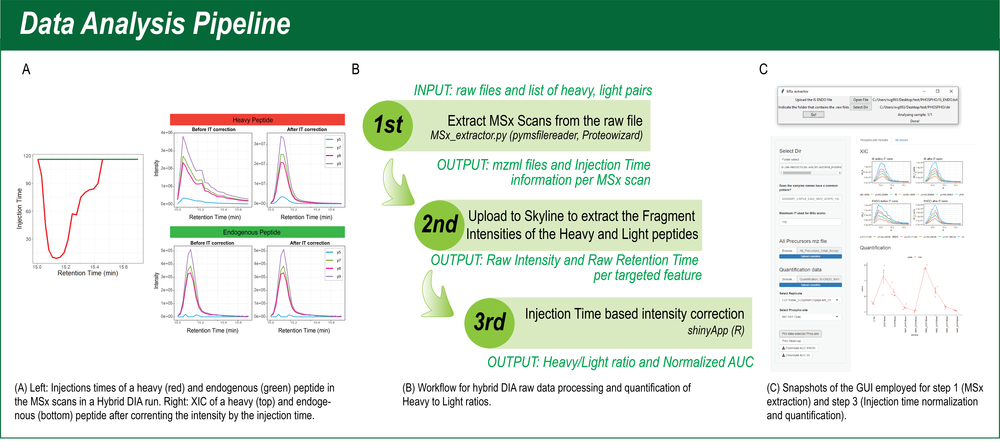

# hybrid-DIA
Hybrid-DIA is a new acquisition method that combines simultaneous targeted and discovery (DIA) proteomics strategies. HybridDIA is based on an Application Programming Interface, which enables the ability to combine targeted and discovery proteomics by intercalating DIA scans with accurate triggering of predefined peptide targets.

The pipeline to analyze HybridDIA files is comprised of three steps:
1. Extract MSx Scans from the raw file. This step requires [pymsfilereader](https://github.com/frallain/pymsfilereader) and [ProteoWizard](https://proteowizard.sourceforge.io/).
2. Upload to [Skyline](https://skyline.ms/project/home/software/Skyline/begin.view) to extract the Fragment Intensities of the Heavy (Internal Standard or IS) and Light (Endogeneous or ENDO) peptides.
3. Injection Time based intensity correction and data visualization.

You can find a complete guide in: [Guide](./Guide_v02.pdf)

